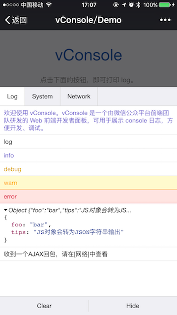

# 混合应用中的javascript实践
`混合应用(hybird app)` 在几年前便进入大众视野，近来更是越发风生水起，深受人民群众的喜爱。


目录

[概念](#concept)

  * [什么是混合应用](#what_is_hybird_app)
  * [混合方式](#how_to_hybird_app)
  
[交互](#interactive)

  * [方法注入](#inject)
  * [参数传递](#param)
  * [方法监听](#listen)
  * [资源加载](#resource)
  
[调试](#debug)

[其他](#other)

  * [兼容性](#compatibility) 
  * [特性启用](#features) 
  * [局部视图](#local_view) 

<a name='concept'></a>
##概念

<a name='what_is_hybird_app'></a>
### 什么是混合应用
`混合应用(hybird app)` 顾名思义，便是将web app与native app混合在一起，既享受html快速开发、快速版本迭代带来的便利，也能使用原生app调用系统接口和第三方SDK的强大扩展能力。

<a name='how_to_hybird_app'></a>
### 混合方式
如同`茴字有几种写法`一般，构建混合应用也有不同的方式。其中一种是主要使用静态html，用 `phonegap` 或 `cordova` 加壳的方式打包成app。另一种则是小部分webview直接引入服务端渲染的html，其他功能都是原生app开发。
其中前一种方式最为出名的解决方案便是使用 `angular.js` + `cordova` 的 [ionic](http://ionicframework.com/),而使用后一种方式的app则数不胜数。
但是无论使用哪一种方式，都面临一个问题，**html和app的交互**。html自己不会动起来，本文将浅谈javascript如何交互app和html。


<a name='interactive'></a>
##交互
<a name='inject'></a>
### 方法注入
常见的app和html交互有 `使用url` 和 `互相调用方法` 两种方式。
`使用url` 这种方式比较简单，通过 `location.href  = 'url'` ，即可将方法和参数传递给app，但是无法传递复杂的数据。
`互相调用方法` 这种方式则较为复杂，除了需要app端写好调用的方法注入到 `window` 对象之外，还需要JavaScript暴露方法给app使用。以常见的评论交互为例：
````javascript
// 点击“发表评论”,js需要调用app的评论框
$('.js-comment').click(function(){
  window.appMethod.comment();
});

// app端在用户点击“发送”按钮时，再调用javascript的插入评论方法（我不会app开发，以下是伪代码）
function comment(){
  TEXTAREA.OPEN();
}
SUBMIT_BUTTON.CLICK(function(){
  NSString * result = [self.webView stringByEvaluatingJavaScriptFromString:@"window.jsMethod.comment()"];
})

````

其中 `window.appMethod` 这个方法，是一个从 iOS 和 android 方法中提取而来的方法，根据手机系统不同，使用不同策略，例如：
````javascript
var window.appMethod = null;

var androidMethod = {
  comment: function(){
    window.android.comment();
  }
};

var iOSMethod = {
  comment: function(){
    location.href = 'ios://comment?'
  }
};


window.appMethod = iOS_DEVICE ? iOSMethod : androidMethod;

````

相比方法的注入点，策略处理，方法的调用时机更为重要。在js中调用一个不存在方法，会发生错误从而导致代码无法继续向下执行。
比如进入页面时，app需要告诉html一些登录信息，以初始化点赞，收藏等组件。如果由app直接调用js方法去通知，那么很可能页面还没加载完，而发生上面提到的错误。
所以好的时机是让js主动去向app发起请求，示例：
````javascript
// 不和谐：app直接通知js更新用户登录状态，可能会发生错误
eval('window.jsMethod.setUser();')


// 和谐：js主动去向app发起请求
$(function(){
  window.appMethod.getUser();
})

// app端在接收到getUser方法后，调用js方法（我不会app开发，以下是伪代码）
function getUser(){
  // 获取user状态，然后执行
  NSString * result = [self.webView stringByEvaluatingJavaScriptFromString:@"window.jsMethod.setUser()"];
}

````

<a name='param'></a>
### 参数传递
以上的示例中的方法并没有进行参数传递，是为了留到这里。
相比JavaScript，在android和iOS方法中传递参数显得极为严格，除了要指定参数个数，还要指定参数类型。
虽然可以通过数组的方式进行不定个数参数的传递，但是指定参数类型还是挺烦人的。所以建议始终使用 `String` 类型作为参数进行传递，复杂的json格式参数使用 `JSON.stringify`。使用url传递则需要对参数进行 encode 编码。
以上面的发表评论为例：
````javascript
# 本段代码使用了jquery

// js给app传参
var androidMethod = {
  comment: function(params){
    window.android.comment( JSON.stringify(params) );
  }
};

var iOSMethod = {
  comment: function(params){
    location.href = 'ios://comment?'+$.param(params)
  }
};

... ... 

$('.js-comment').click(function(){
  var params = {
    "user_id": 30,
    "article_id": 958,
    "article_type": "news"
  };
  window.appMethod.comment(params);
});


// app给js传参
SUBMIT_BUTTON.CLICK(function(){
   var params = {
    "comment_id": 5484,
    "comment_content": "我不会写app，姑且用js写伪代码"
  };
  NSString * result = [self.webView stringByEvaluatingJavaScriptFromString:@"window.jsMethod.comment( JSON.stringify(params) )"];
})
````

<a name='listen'></a>
### 方法监听
这里的方法监听指的是app对js方法的单向监听。
因为需要app监听的js方法，都是显示的调用了app方法，或是跳转到了一个url。调用app的方法自不待言，url的监听却有多种。
一种是a链接的 `http` GET 请求的监听，多见于 `下一篇文章` , `相关文章` 等跳转页面的方法。一般来说不用带参数。还有一种是自定义的 `schema` 监听，使用这种方式一般是不带或带较少的参数，比如 `myiOS://mymethod?`。

<a name='#resource'></a>
### 资源加载
把资源加载放到交互里面，我也不知道合不合适。对于 [第一种混合方式](#how_to_hybird_app) 来说，可以把更多的静态资源放到本地，然后通过app接口加载。对于第二种，更多的还是从服务端渲染并加载资源。
对于一些交互类的数据，而非资源，既可以选择存放在浏览器的localStorge中，也可以选择存放于app本地文件，这取决于哪一方进行操作运算了。


<a name='debug'></a>
##调试
html的移动端调试时很困难的，嵌入app的html调试更是难上加难。因为js和app的方法相互调用，任何一方出错，都会导致程序不按套路运行。
除了仔细的约定两端的方法和检查代码的错误外，还需要一个强力的工具。在这里推荐使用 [vConsole](https://github.com/WechatFE/vConsole/blob/dev/README_CN.md) ，可以比较直观的定位到错误。

> vConsole 截图




<a name='other'></a>
##其他
<a name='compatibility'></a>
### 兼容性
html在app中的兼容性取决于app内嵌浏览器内核。iOS系统默认的浏览器是safari，而andriod系统默认的浏览器则五花八门。

如果选择系统默认浏览器作为内嵌浏览器的话，ios一般兼容性较好，能取得和PC端一致的效果。android机型则会比较悲剧，使用 [crosswalk方案](https://crosswalk-project.org/) 或许是个正确的选择。
<a name='features'></a>
### 特性启用
在内嵌浏览器中，html5的某些特性默认是关闭的，比如 `localStorge` , 需要app端手动去开启。所以在开发中一定要做好可用性检测，减少出现bug的几率。
<a name='local_view'></a>
### 局部视图
当html作为webview的局部视图被加载时，由于app虽然可以获取到页面加载后的高度，但是无法获取动态改变后的高度，使得局部滚动失效。
所以在作为局部视图加载时，如果需要页面高度会根据比如评论，动画效果而发生改变的话，需要及时通知app更新webview高度。